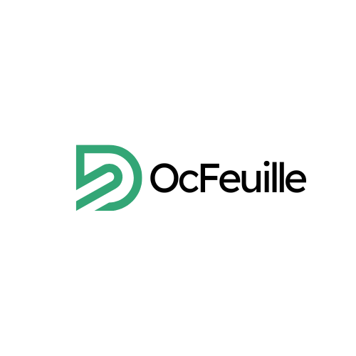
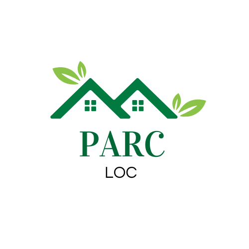
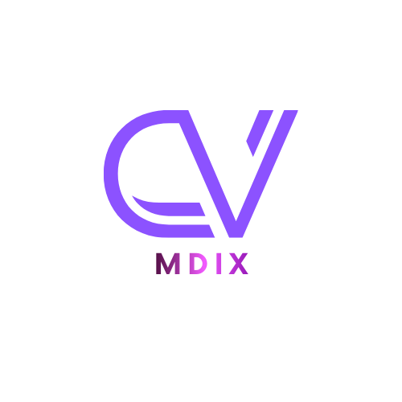

## Hi there 👋

<h2 align="center">👋 Hey, I'm El Mehdi El Kalakhi</h2>
<h3 align="center">Fullstack Java / Angular / React Developer</h3>

  

---

## 🚀 About Me

- 👨‍💻 **Fullstack Developer** specialized in **Java & Angular**
- ☕ Strong experience in **Java, Spring Boot, Microservices & WebFlux**
- ⚡ Passionate about **clean architecture, performance**, and scalable backend solutions
- 📚 Always learning cutting-edge technologies & improving development workflow
- 🛠️ Building robust backend services with microservices, Kafka, CI/CD, Docker
- 🎨 Creating smooth & modern UIs using Angular & React

---

## 🧠 My Favorite Stack

### **Backend**

  
  
  
  
  

### **Frontend**

  
  

### **DevOps & Tools**

  
  
  

---

## 📊 PERSONAL PROJECTS

  
  
   

<!-- ---

## 🐍 Contribution Snake

  

 -->

---

## 📫 Contact Me

- 💼 LinkedIn: *https://www.linkedin.com/in/elmehdi-el-kalakhi-98aab5203/*
- 📧 Email: *elmehdi.elkalakhi@gmail.com*

---

⭐ **Feel free to explore my repositories !**
